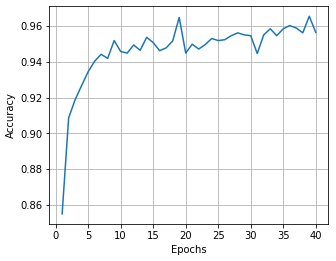

# Traffic Sign Recognition - Writeup

## Build a Traffic Sign Recognition Project

The goals/steps of this project are the following:

- Load the data set (see below for links to the project data set)
- Explore, summarize and visualize the data set
- Design, train and test a model architecture
- Use the model to make predictions on new images
- Analyze the softmax probabilities of the new images
- Summarize the results with a written report

# Project

The project implementation can be found [Traffic Classifier Simplified.ipynb](Traffic%20Classifier%20Simplified.ipynb).  It consists in five steps.

## Step 0: Load The Data
In this steps, the provided data is loaded using the `pickle` library.
The images have labels to recognize what they represent. The labels are numbers, but there is a [.csv file](data/signnames.csv) containing the mapping between the labels and a text name of the image to make it more human-friendly.

## Step 1 : Dataset Summary & Exploration

Here the data set is explored. First, show some general numbers about it:

- Number of training examples = 34799
- Number of testing examples = 12630
- Number of validation examples = 4410
- Image data shape = (32, 32, 3)
- Number of classes = 43

We have 43 different traffic signs. Some random images are shown:

and the distribution of the labels is presented:

The distribution has too many images on the first labels. I needed to have more images to train out model. The process is called [data augmentation](https://www.techopedia.com/definition/28033/data-augmentation). New images are created from the training data by transforming images with small distribution. The transformation used were arbitrary scaling [1.0 - 1.3], random translation [-3, 3] pixels in both axes, and random rotation [-90, 90] degrees.

After both new and original images are together, the train data has a more even distribution:

## Step 2: Design and Test a Model architecture

### Pre-processing

Neural networks work better if the input(feature) distributions have mean zero. A suggested way to have that normalization was to operate on each pixel by applying: `(pixel - 128)/128.`
There are a lot of different preprocessing we could do to improve the image qualities (I did some testing [here](Experiments%20Traffic%20Sign%20Classifier.ipynb)), but I decided to go just for gray scaling the images.

### Model architecture

First, I started with the [LeNet](https://github.com/darienmt/intro-to-tensorflow/blob/master/LeNet-Lab.ipynb) lab provided by [Udacity](https://github.com/udacity/CarND-LeNet-Lab). After a few iteration of increasing epochs, etc. My goal was to get 90% accuracy with 15 epochs. To have that, I increased the different layers of this architecture:

|Layer | Description|Output|
|------|------------|------|
|Input | RGB image| 32x32x3|
|Convolutional Layer 1 | 1x1 strides, valid padding | 28x28x16|
|RELU| | |
|Max Pool| 2x2 | 14x14x16|
|Convolutional Layer 2 | 1x1 strides, valid padding | 10x10x64|
|RELU| | |
|Max Pool | 2x2 | 5x5x64|
|Fatten| To connect to fully-connected layers |
|Fully-connected Layer 1| | 1600|
|RELU| | |
|Dropout| 0.7 keep probability ||
|Fully-connected Layer 2| | 240
|RELU| | |
|Dropout| 0.7 keep probability||
|Fully-connected Layer 3| | 43

The introduction of dropout help to stabilize the training process.

### Train, Validate and Test the Model

I started training with 15 epochs, and they increased it to 40. Using 128 as batch size (I didn't play with this parameter), learning rate 0.001 and use [Adam](http://sebastianruder.com/optimizing-gradient-descent/index.html#adam) optimizer not needing to change the learning rate. Here is my network accuracy by epoch:

## Step 3: Test a Model on New images

In this step, five new images found on the Web are classified.
First, the images are loaded and presented:

The same pre-processing is applied to them:

And then they are fed to the neural network. I was curious about the output value distribution:

On four of them, there is a clear winner (highlighted on the graph), but there was not a clear winner on the road_work.jpg. That make the network 80% accurate on this images:

Here are the top five softmax probabilities for them and their name values:

- Image: webimages/stop_sign.jpg
  - Probabilities:
    - 32.556 : 14 - Stop
    - 8.078 : 24 - Road narrows on the right
    - 6.619 : 29 - Bicycles crossing
    - 5.679 : 0 - Speed limit (20km/h)
    - 2.261 : 26 - Traffic signals

- Image: webimages/yield_sign.jpg
  - Probabilities:
    - 65.943 : 13 - Yield
    - 11.349 : 29 - Bicycles crossing
    - -0.900 : 35 - Ahead only
    - -3.275 : 25 - Road work
    - -6.000 : 34 - Turn left ahead

- Image: webimages/road_work.jpg
  - Probabilities:
    - 29.975 : 30 - Beware of ice/snow
    - 22.087 : 24 - Road narrows on the right
    - 16.370 : 29 - Bicycles crossing
    - 13.887 : 23 - Slippery road
    - 11.258 : 21 - Double curve

- Image: webimages/left_turn.jpg
  - Probabilities:
    - 89.443 : 34 - Turn left ahead
    - 18.121 : 29 - Bicycles crossing
    - 11.056 : 23 - Slippery road
    - 2.369 : 37 - Go straight or left
    - -0.442 : 35 - Ahead only

- Image: webimages/60_kmh.jpg
  - Probabilities:
    - 37.983 : 3 - Speed limit (60km/h)
    - 15.663 : 38 - Keep right
    - 9.374 : 9 - No passing
    - 2.040 : 23 - Slippery road
    - 1.109 : 29 - Bicycles crossing

## Step 4 (Optional): Visualize the Neural Network's State with Test Images

This was an optional step, but it is interesting to see the features each layer is focused on.
