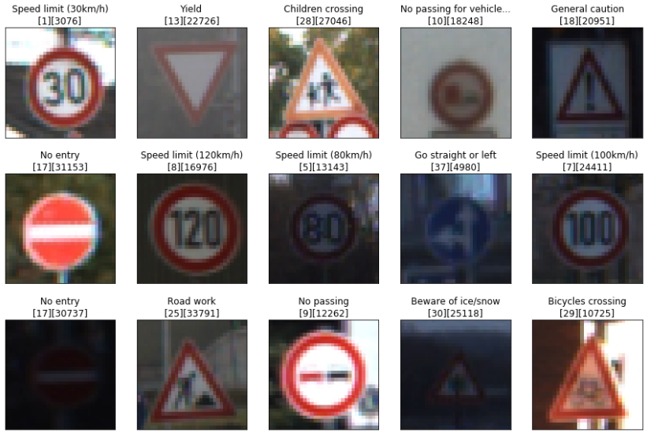
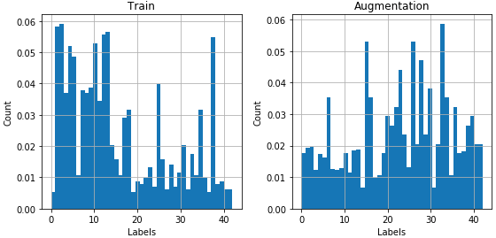
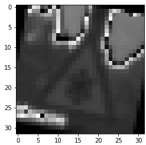
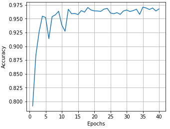

# Traffic Sign Recognition - Writeup

## Build a Traffic Sign Recognition Project

The goals/steps of this project are the following:

- Load the data set (see below for links to the project data set)
- Explore, summarize and visualize the data set
- Design, train and test a model architecture
- Use the model to make predictions on new images
- Analyze the softmax probabilities of the new images
- Summarize the results with a written report

# Project

The project implementation can be found [Traffic Classifier Simplified.ipynb](Traffic%20Classifier%20Simplified.ipynb).  It consists in five steps.

## Step 0: Load The Data
In this steps, the provided data is loaded using the `pickle` library.
The images have labels to recognize what they represent. The labels are numbers, but there is a [.csv file](data/signnames.csv) containing the mapping between the labels and a text name of the image to make it more human-friendly.

## Step 1 : Dataset Summary & Exploration

Here the data set is explored. First, show some general numbers about it:

- Number of training examples = 34799
- Number of testing examples = 12630
- Number of validation examples = 4410
- Image data shape = (32, 32, 3)
- Number of classes = 43

We have 43 different traffic signs. Some random images are shown:

and the distribution of the labels is presented:

The distribution has too many images on the first labels. I needed to have more images to train out model. The process is called [data augmentation](https://www.techopedia.com/definition/28033/data-augmentation). New images are created from the training data by transforming images with small distribution. The transformation used were arbitrary scaling [1.0 - 1.3], random translation [-3, 3] pixels in both axes, and random rotation [-90, 90] degrees.

After both new and original images are together, the train data has a more even distribution:

## Step 2: Design and Test a Model architecture

### Pre-processing

Neural networks work better if the input(feature) distributions have mean zero. A suggested way to have that normalization was to operate on each pixel by applying: `(pixel - 128)/128.`
There are a lot of different preprocessing we could do to improve the image qualities (I did some testing [here](Experiments%20Traffic%20Sign%20Classifier.ipynb)), but I decided to go just for gray scaling the images.

The final pre-processing used consist of two steps:

- Converting the images to gray scale using **OpenCV**.
- Transforming the pixel values to the range [-1, 1] by subtracting 128 and then divide it by 128.

### Model architecture

The starting model was [LeNet](http://yann.lecun.com/exdb/lenet/) provided by [Udacity](https://github.com/udacity/CarND-LeNet-Lab). This model was proved to work well in the recognition hand and print written character. It could be a good fit for the traffic sign classification. After modifying the standard model work with color pictures, I could not have more than 90% accuracy with my current dataset and 15 epochs. To improve that, start making the first two convolution layer deeper, and then increase the size of the fully-connected layers as well. With these modifications, I got just above 90% accuracy. To go further, I added two dropout layers with 0.7 keep probability and increased the training epochs to 40. The final model is described as follows:

|Layer | Description|Output|
|------|------------|------|
|Input | RGB image| 32x32x3|
|Convolutional Layer 1 | 1x1 strides, valid padding | 28x28x16|
|RELU| | |
|Max Pool| 2x2 | 14x14x16|
|Convolutional Layer 2 | 1x1 strides, valid padding | 10x10x64|
|RELU| | |
|Max Pool | 2x2 | 5x5x64|
|Fatten| To connect to fully-connected layers |
|Fully-connected Layer 1| | 1600|
|RELU| | |
|Dropout| 0.6 keep probability ||
|Fully-connected Layer 2| | 240
|RELU| | |
|Dropout| 0.6 keep probability||
|Fully-connected Layer 3| | 43

The introduction of dropout help to stabilize the training process.

### Train, Validate and Test the Model

I started training with 15 epochs, and they increased it to 40. Using 128 as batch size (I didn't play with this parameter), learning rate 0.001 and use [Adam](http://sebastianruder.com/optimizing-gradient-descent/index.html#adam) optimizer not needing to change the learning rate. Here is my network accuracy by epoch:

The final model have:
- **Train Accuracy**: 99.9 %
- **Validation Accuracy**: 96.8 %
- **Test Accuracy**: 95.0 %

## Step 3: Test a Model on New images

In this step, five new images found on the Web are classified.
First, the images are loaded and presented:

The only image that should be complicated for the neural network to identify is `road_work.jpg` because it is a vertical flip of the road work images used on training. I didn't know that, but it could be interesting to see how it works on it.

The same pre-processing is applied to them:

And then they are fed to the neural network. I was curious about the output value distribution:

Four out of the five images were classified correctly. That make the network 80% accurate on this images:

Here are the top five softmax probabilities for them and their name values:

- Image: webimages/stop_sign.jpg
  - It was classified correctly.
  - Probabilities:
    - **0.999998 : 14 - Stop**
    - 0.000002 : 0 - Speed limit (20km/h)
    - 0.000000 : 2 - Speed limit (50km/h)
    - 0.000000 : 1 - Speed limit (30km/h)
    - 0.000000 : 4 - Speed limit (70km/h)

- Image: webimages/yield_sign.jpg
  - It was classified correctly.
  -  Probabilities:
    - **1.000000 : 13 - Yield**
    - 0.000000 : 29 - Bicycles crossing
    - 0.000000 : 23 - Slippery road
    - 0.000000 : 34 - Turn left ahead
    - 0.000000 : 22 - Bumpy road

- Image: webimages/road_work.jpg
  - **It was not classified correctly.**
  - Probabilities:
    - 0.999996 : 28 - Children crossing
    - 0.000004 : 24 - Road narrows on the right
    - 0.000000 : 30 - Beware of ice/snow
    - 0.000000 : 29 - Bicycles crossing
    - 0.000000 : 21 - Double curve

- Image: webimages/left_turn.jpg
  - It was classified correctly.
  - Probabilities:
    - **1.000000 : 34 - Turn left ahead**
    - 0.000000 : 14 - Stop
    - 0.000000 : 38 - Keep right
    - 0.000000 : 15 - No vehicles
    - 0.000000 : 29 - Bicycles crossing

- Image: webimages/60_kmh.jpg
  - It was classified correctly.
  - Probabilities:
    - **1.000000 : 3 - Speed limit (60km/h)**
    - 0.000000 : 2 - Speed limit (50km/h)
    - 0.000000 : 38 - Keep right
    - 0.000000 : 5 - Speed limit (80km/h)
    - 0.000000 : 13 - Yield

## Step 4 (Optional): Visualize the Neural Network's State with Test Images

This was an optional step, but it is interesting to see the features each layer is focused on.
